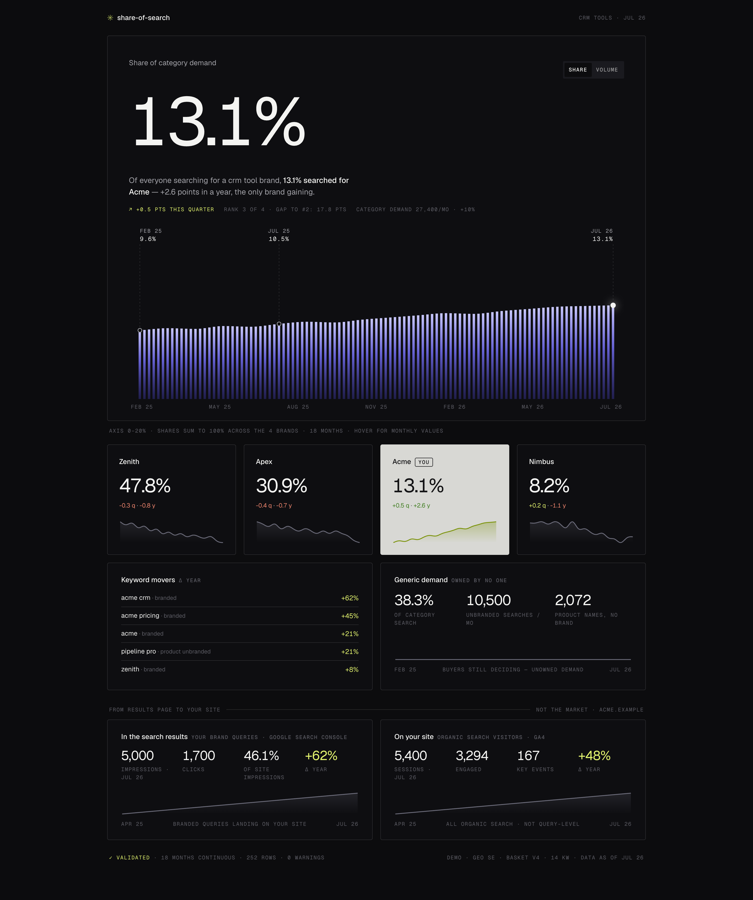

# share-of-search

**Every month, buyers cast votes by typing a brand name into a search box. This tool counts them — yours and your competitors' — and tells you honestly what the count means.**

Share of search — your brand's slice of all branded search demand in your category — is one of the few marketing numbers that sees the *whole market*, not just your own funnel, and it correlates with market-share movement (Les Binet, IPA). Commercial tools sell it behind dashboards you can't audit. This is the open version: a deterministic pipeline from public search-volume data to a dashboard and a shareable report, with validation as a first-class feature and every methodological limit stated where you can see it.



*The demo dashboard — a fictional category. Every number is computed by the pipeline; the app has no numbers of its own.*

## Try it in 60 seconds

```bash
git clone https://github.com/olson-adam/share-of-search && cd share-of-search
python3 examples/make_demo.py
python3 scripts/sos_calc.py --workspace examples/demo-workspace --source demo
python3 scripts/serve.py
```

Python 3.11+ standard library only — no pip install, no accounts, no Node (the dashboard ships prebuilt; Node is only needed if you modify the app). The demo is a fictional category; every value regenerates byte-identically.

## Getting your real numbers — three on-ramps

**A. You have any Google Ads account (most people — no API needed).**
Export historical search volumes from the Keyword Planner UI (Keyword Planner → your keywords → download), then:

```bash
python3 scripts/fetch_volumes.py --workspace ws/ --provider csv --file export.csv \
    --map keyword=Keyword --map month=Month --map volume=Searches
```

Column names are mapped freely (`--map ours=theirs`), and volumes parse locale-safely — a Swedish `8 900` imports as 8900, never as 8. More on why that matters below.

**B. You want it automated without Google API access.**
[DataForSEO](https://dataforseo.com) serves the same Keyword Planner data as a paid API (fractions of a cent per keyword; the cost of every call is printed). One-time setup:

```bash
security add-generic-password -s dataforseo-api -a <login> -w <api-password>
python3 scripts/fetch_volumes.py --workspace ws/ --provider dataforseo
```

**C. You have Google Ads API access (agencies, in-house teams).**
Developer token in `~/google-ads.yaml`, gcloud ADC for OAuth. This is the one path that needs a package (`pip install google-ads`):

```bash
python3 scripts/fetch_volumes.py --workspace ws/ --provider keyword-planner --customer-id 1234567890
```

All providers merge into the same history file — refreshes never delete old months.

## The basket — the judgment step no tool should automate

Your share number is only as good as the keyword basket that defines the category. The schema is three types: **Branded** (carries a brand), **Generic** ("crm tools" — owned by no one), and **Product Unbranded** — product names searched *without* their brand ("neo 85"). That last type is the one every SoS setup misses, and missing it understates whichever brand owns those products.

A basket is one JSON file:

```json
{
  "category": "hearing protection", "geo": "SE", "language": "sv",
  "focus_brand": "Acme", "version": "1",
  "keywords": [
    {"keyword": "acme",        "brand": "Acme",   "type": "Branded"},
    {"keyword": "zenith",      "brand": "Zenith", "type": "Branded"},
    {"keyword": "ear defenders", "brand": "-",    "type": "Generic"},
    {"keyword": "neo 85",      "brand": "-",      "type": "Product Unbranded"}
  ]
}
```

```bash
python3 scripts/basket_builder.py init ws/            # writes this template to ws/basket.json
python3 scripts/basket_builder.py suggest --brands "Acme,Rival,Third" --terms "crm,pipeline" --out candidates.json
python3 scripts/basket_builder.py check ws/basket.json
```

`suggest` fetches real volumes for brand/term candidates so you tag evidence, not guesses — note it uses the **paid DataForSEO API** (it asks before billing; `--yes` skips the prompt). It never auto-builds the basket: which keywords define your category is a judgment call. Version the basket — a share series is only comparable within one basket version.

## The three layers (kept honestly apart)

| Layer | Source | What it answers | What it can never be |
|---|---|---|---|
| **Market demand** | Keyword Planner / DataForSEO | How much branded demand exists, and whose name is on it | — |
| **In the search results** | Google Search Console | How much of *your* branded demand your site captures (impressions, clicks, position) | Market share — GSC only sees your site |
| **On your site** | GA4 | What organic search produces (sessions, engagement, key events) | "Revenue from brand searches" — GA4 has no query dimension |

Layers 2–3 use their own read-only OAuth token (one browser consent, stored separately, never touches your gcloud ADC):

```bash
python3 scripts/gsc_capture.py --list-sites
python3 scripts/gsc_capture.py --workspace ws/ --site sc-domain:example.com
python3 scripts/ga4_yield.py --list-properties
python3 scripts/ga4_yield.py --workspace ws/ --property 123456789
```

A side effect worth having: the GSC per-query dump answers the question every small brand has — *is that search volume really my brand, or a typo for something else?* The queries Google actually matched to your site settle it.

## The monthly loop

```bash
python3 scripts/fetch_volumes.py --workspace ws/ --provider <yours>
python3 scripts/sos_calc.py --workspace ws/ --source <yours>
python3 scripts/serve.py --workspace ws/                       # view
python3 scripts/serve.py --workspace ws/ --export report.html  # share
```

`--export` produces **one self-contained HTML file** — charts, fonts, data, everything embedded — that opens anywhere and can be mailed to whoever asked "how are we actually doing?". Cron recipe in [SKILL.md](SKILL.md).

## Validation is a feature, not a chore

The bug that shaped this tool: a locale-blind parser once read the Swedish-formatted volume `8 900` as **8**, and quietly inflated the smallest brand's share threefold on a live dashboard. Nobody noticed for weeks, because nothing was checking.

So here, `sos_calc` **refuses to produce a snapshot** until validation passes: month gaps, keywords missing from the basket, partial coverage, outlier jumps, ambiguous numbers. The verdict is embedded in every snapshot and rendered in the dashboard footer. The eval suite ([`evals/run.sh`](evals/run.sh)) keeps that locale bug as a permanent regression fixture, along with determinism checks — same inputs, byte-identical output, always.

## What this number is — and is not

Share of search is a *leading indicator* that correlates with market-share movement. It is not market share, it is not revenue, and a single month proves nothing — Keyword Planner volumes are bucketed, so quarters tell truer stories than months (the dashboard flags quarter-deltas that are driven by a single month). Generic demand belongs to no one and is never counted as a competitor. Keyword movers need 13+ months of history and ignore keywords under 30 searches/month a year ago — percentage swings on tiny bases are noise. When the data can't support a comparison, the tool says so instead of making one.

## For Claude Code users

```bash
npx skills add -g olson-adam/share-of-search
```

[SKILL.md](SKILL.md) teaches the agent the whole workflow — basket interviews, monthly runs, and the presentation rules (never "market share", surface validation warnings, quarters over months).

## License

MIT. Fictional demo data only — Acme and its rivals are placeholders; run it on your own category.
